# Restaurant App

> Restaurant App es una plataforma web en tiempo real que digitaliza la toma y gestión de pedidos en un restaurante.
> Permite a los meseros asignar mesas y enviar pedidos directamente a cocina, notifica a meseros cuando un plato está listo,
> y agiliza el cierre de cuentas en caja. Un panel de administración permite configurar menú, mesas y usuarios.

---

## 📋 Características

- 📝 **Tomar pedidos** por meseros con selección de mesa y carrito.
- 🍳 **Monitoreo en cocina**: lista de pedidos pendientes, marcar como “Listo”.
- 💳 **Facturación**: buscar orden por número de mesa y marcar como pagado.
- 🔔 **Notificaciones** en tiempo real vía WebSockets (Socket.io).
- 🔒 **Autenticación JWT** con roles: Mesero, Cocinero, Cajero, Admin.
- 🛠 **Panel Admin**: CRUD de productos, mesas y usuarios.
- 🧪 **Validación** de datos con Joi.
- 📊 **Cálculo automático** de totales y calorías.

---

## 📸 Capturas de pantalla

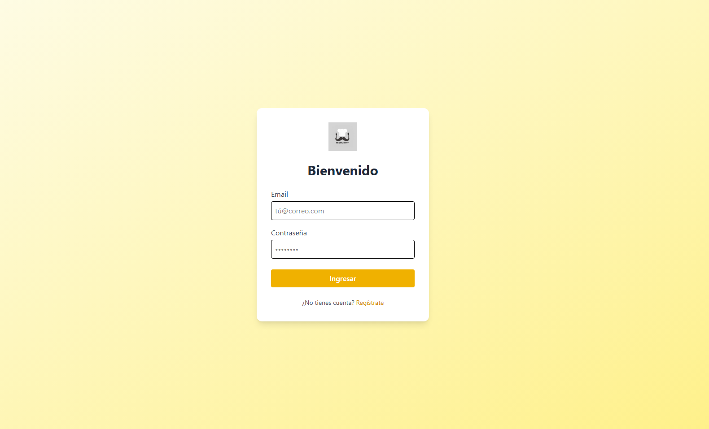
_Pantalla de inicio de sesión_

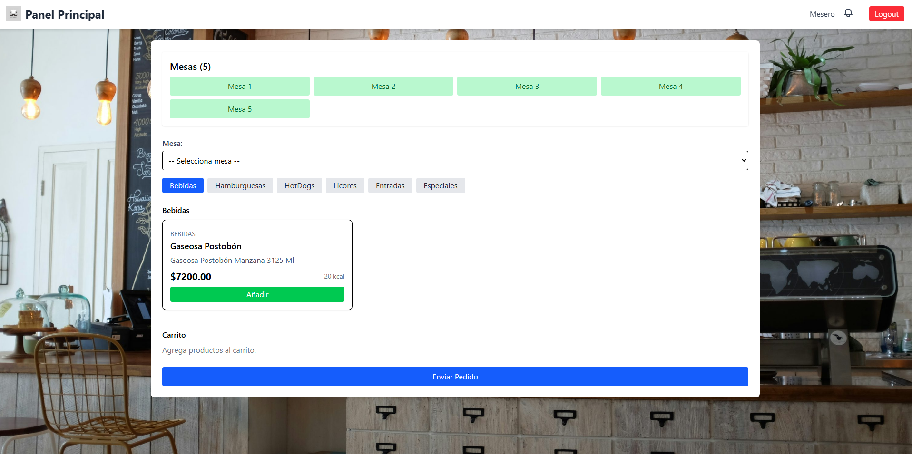
_Dashboard para el mesero, con carrito y selección de categorías_
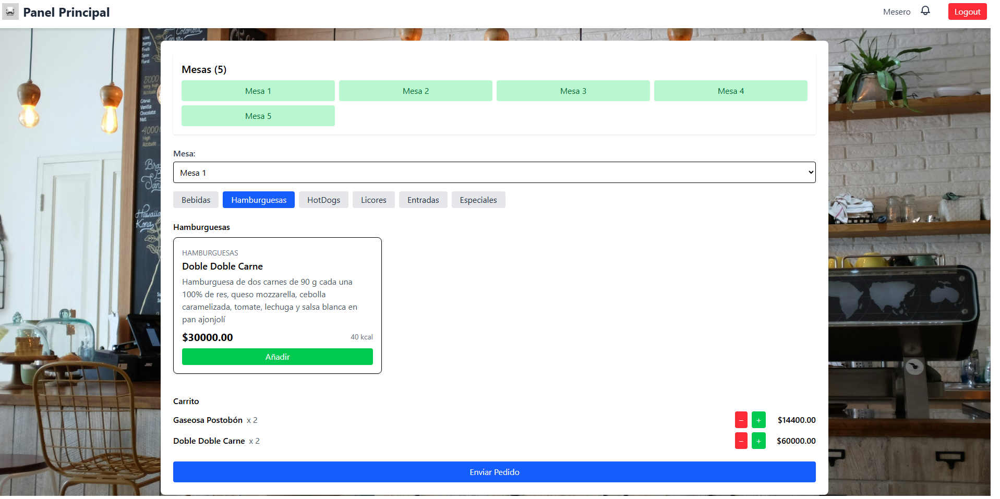
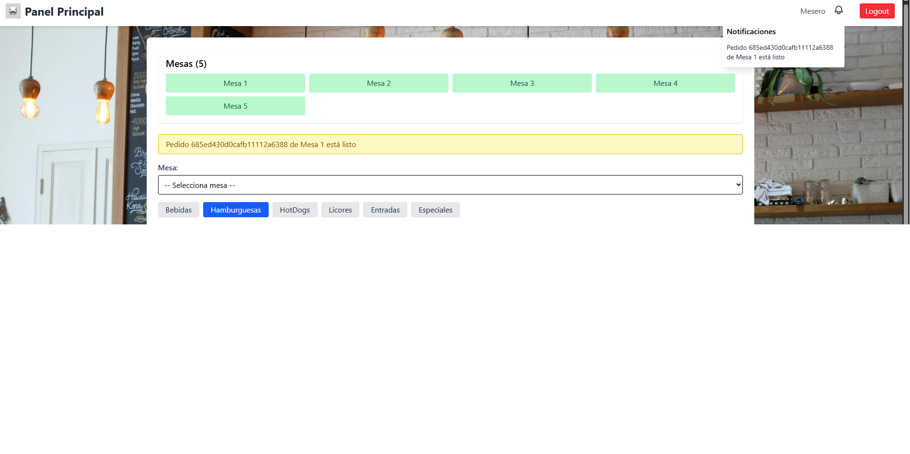

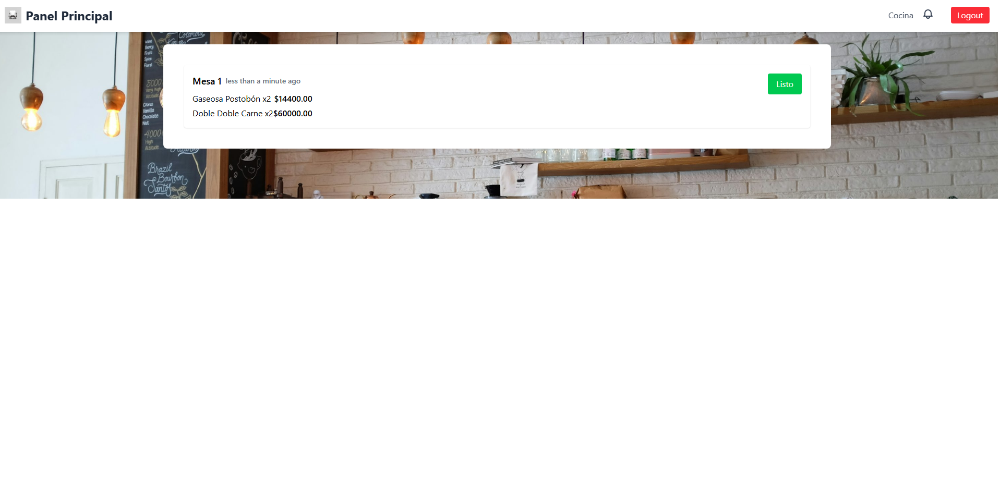
_Panel de cocina mostrando pedidos pendientes_
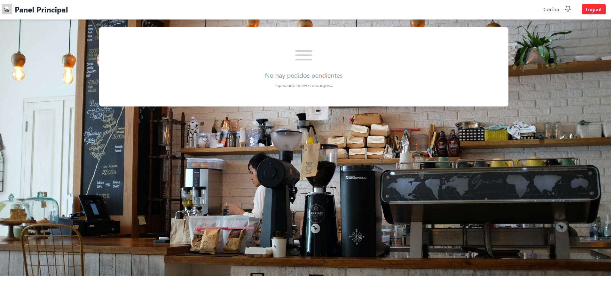
_Y en caso de ya haber enviado todos los pedidos._

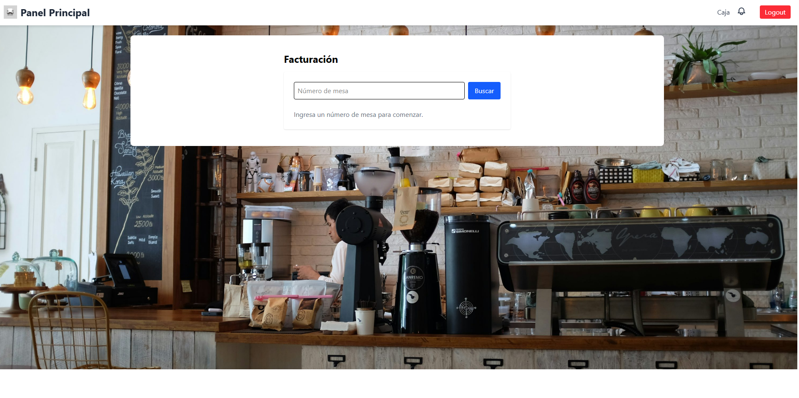
_Página de facturación, se busca por número de mesa y sale la orden completa_
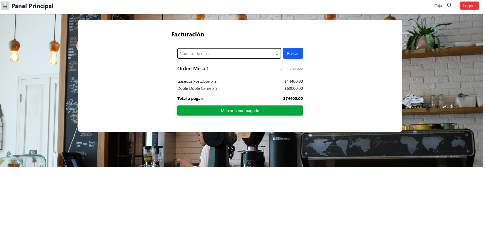

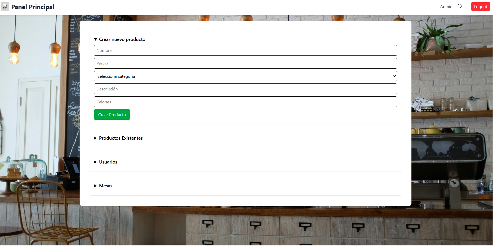
_Panel de administración y creación tanto de productos, mesas y usuarios_
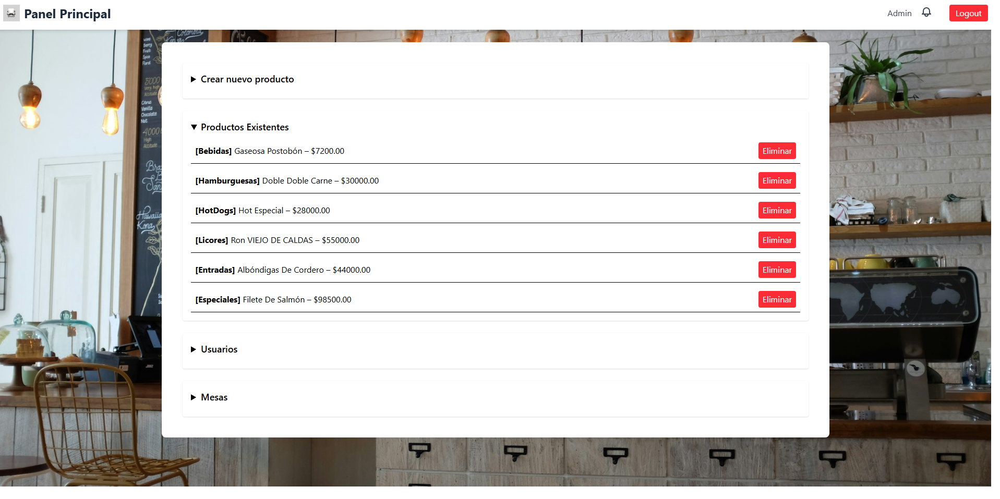
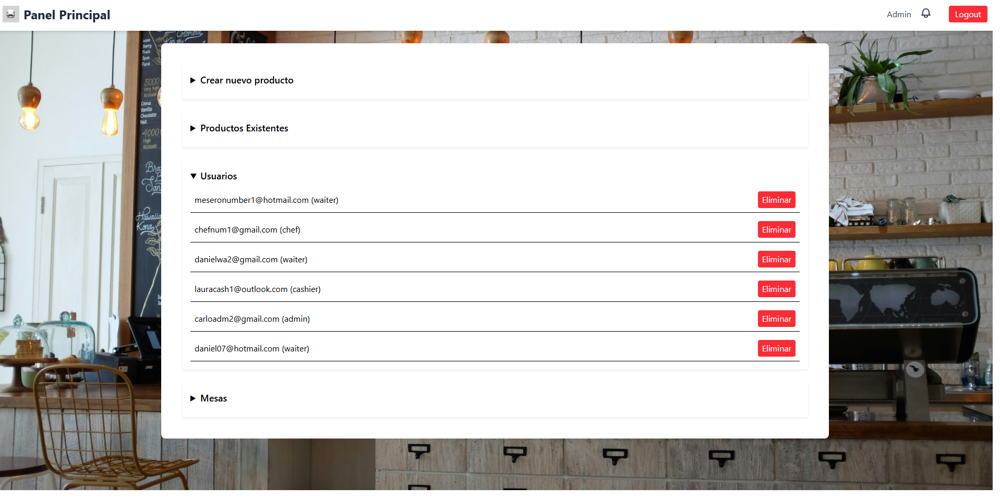
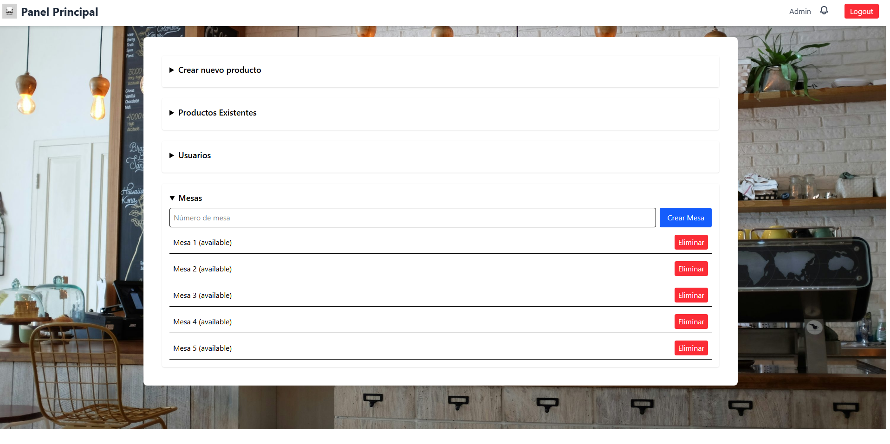

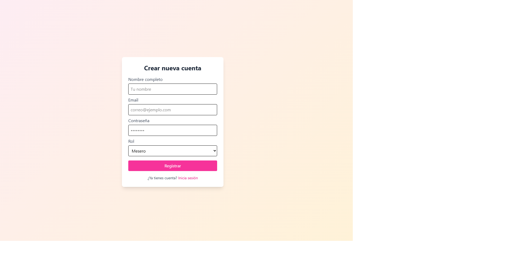
_Sección de nuevo registro según el rol requerido._

## 🛠 Tecnologías

- **Frontend:** React, Vite, Tailwind CSS, React Router, Socket.io‑client
- **Backend:** Node.js, Express, MongoDB Atlas, Mongoose, Socket.io
- **Autenticación:** JWT
- **Validación:** Joi
- **Despliegue:**
  - Frontend en Vercel: https://restaurant-app-vert-two.vercel.app
  - Backend en Render:

---

**Demo Frontend (Vercel)**: https://restaurant-app-vert-two.vercel.app
(App web full‑stack para gestionar productos, mesas y órdenes en tiempo real con roles (mesero, chef, cajero y admin).)

## 🛠️ Instalación

### Prerrequisitos

- [Node.js](https://nodejs.org/) v16+
- [npm](https://www.npmjs.com/) o [Yarn](https://yarnpkg.com/)
- Una cuenta de MongoDB Atlas o un servidor MongoDB accesible

---

### 1. Clonar el repositorio y arranca ambos servicios por separado.

```bash
git clone https://github.com/emmanuel/restaurant-app.git
cd restaurant-app


### 2. Clonar el repositorio

- En la raíz tienes dos carpetas, server/ y client/, cada una con su propio .env.example.

# Copiar ejemplos de env
cp server/.env.example server/.env
cp client/.env.example client/.env

# Luego abre server/.env y client/.env y reemplaza los placeholders:

server/.env
MONGODB_URI=<tu cadena de conexión de MongoDB Atlas>
JWT_SECRET=<una cadena aleatoria para firmar tus tokens>
FRONTEND_URL=http://localhost:5173
PORT=5000

client/.env
VITE_API_URL=http://localhost:5000

----
### 3. instalar dependencias

- Instalar dependencias y levantar el backend

cd server
npm install       # o yarn install
npm run dev       # o yarn dev (si tienes nodemon)

- Deberías ver algo como:

✅ Conectado a MongoDB Atlas
🚀 Servidor corriendo en http://localhost:5000

- Instalar dependencias y levantar el frontend
- En otra terminal:


cd ../client
npm install       # o yarn install
npm run dev       # o yarn dev

- Y ya estaria corriendo en la App en https://localhost:5173
```

## 🚪 Roles y funcionalidades

- **Mesero**: crea órdenes por mesa.
- **Chef**: ve pedidos en tiempo real y gestiona su estado.
- **Cajero**: checkout por número de mesa.
- **Admin**: CRUD de productos, mesas y usuarios.

## 🧪 Prueba rápida

1. Entra a la demo: https://restaurant-app-vert-two.vercel.app
2. Regístrate o inicia sesión con usuarios demo:
   - meseronumber1@hotmail.com / Waiter1\*
   - chefnum1@gmail.com / Cocinero1\*
   - lauracash1@outlook.com / Laucash1\*
   - Carloadm2@gmail.com / Carmin2\*
3. Explora el flujo: crear orden (mesero) → ver en cocina (chef) → checkout (cajero).

> _Nota_: Si la API se pausa (free tier), el primer request puede tardar unos segundos.

### Uso

# Registrar usuarios

- Visita http://localhost:5173/register para crear cuentas de mesero, chef, cajero y admin.

# Flujo mesero

- Entra a http://localhost:5173/waiter, selecciona mesa, añade productos y envía pedido.

# Flujo cocina

- Entra a http://localhost:5173/kitchen y verás todos los pedidos “pending”. Marca “Listo” para notificar al mesero.

# Flujo caja

- Entra a http://localhost:5173/checkout, introduce número de mesa y “Buscar” para ver total. Haz clic en “Marcar como pagado”.

# Panel admin

- Entra a http://localhost:5173/admin (sólo rol admin), gestiona productos, mesas y usuarios.

## ⚙️ Scripts útiles

# En la raíz

npm install # instala dependencias en server y client
npm run dev # levanta simultáneamente backend y frontend (puedes configurarlo con concurrently)

# Solo backend

cd server && npm run dev

# Solo frontend

cd client && npm run dev

### 📄 API

| Método | Ruta                      | Descripción                       | Roles autorizados |
| ------ | ------------------------- | --------------------------------- | ----------------- |
| POST   | `/api/auth/register`      | Registrar nuevo usuario           | —                 |
| POST   | `/api/auth/login`         | Iniciar sesión                    | —                 |
| GET    | `/api/orders/kitchen`     | Listar pedidos “pending” (cocina) | chef              |
| POST   | `/api/orders`             | Crear o actualizar orden (mesero) | waiter            |
| PUT    | `/api/orders/:id/ready`   | Marcar pedido listo (cocina)      | chef              |
| GET    | `/api/checkout/:mesa`     | Obtener orden activa (cajero)     | cashier           |
| POST   | `/api/checkout/:mesa/pay` | Marcar orden como pagada          | cashier           |
|        |                           |                                   |                   |
